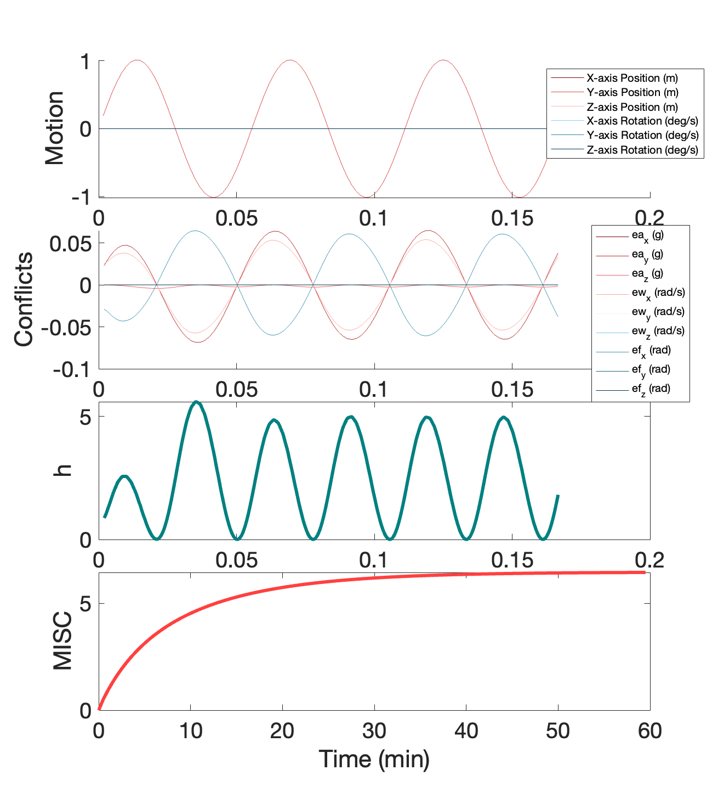

# Motion-Sickness-Dynamics

This code is intended to serve as an implementation to the motion sickness dynamics model presented in Experimental Brain Research.

See: https://doi.org/10.1007/s00221-023-06684-9 

Simulink v. 2023b is required to run the observer model with motion sickness symptom dynamics. 

# Update Oct 2023
The most recent motion sickness model has updated parameters for the sensory weights and motion sickness dynamics. Originally, the model was trained used a Ka gain of -0.5, and the prior MS dynamics corresponded to this augmented set of perceptual parameters, the rest of the parameters are provided in Newman 2009 and Clark et al. 2019 (per the refernces in our paper). In October 2023, we updated the model, correctly trained with a Ka = -4. 

Alternative sets of perceptual parameters were explored in Irmak et al. 2023, and we have not yet examined the performance with such alternative sets.

# Run Simulations
Within the 'Main.m' file, you can define a 'Custom' motion profile, picking 6DOF motion and the environment G-level over time.

Additionally, you can use the unfiltered or bandpass filtered dynamics, explored in Allred et al. 2023.

The motion profile is defined for columns 1-3 are being xyz position and columns 4-6 are xyz rotations.

The following pre-defined example simulations are provided:
'Cian' (Cian et al. 2011). An OVAR motion profile explored as our validation motion paradigm
'Gravity Transition'a 1g-0g gravity transition without adaptation over time during roll motion

The final output of the file is the following:

